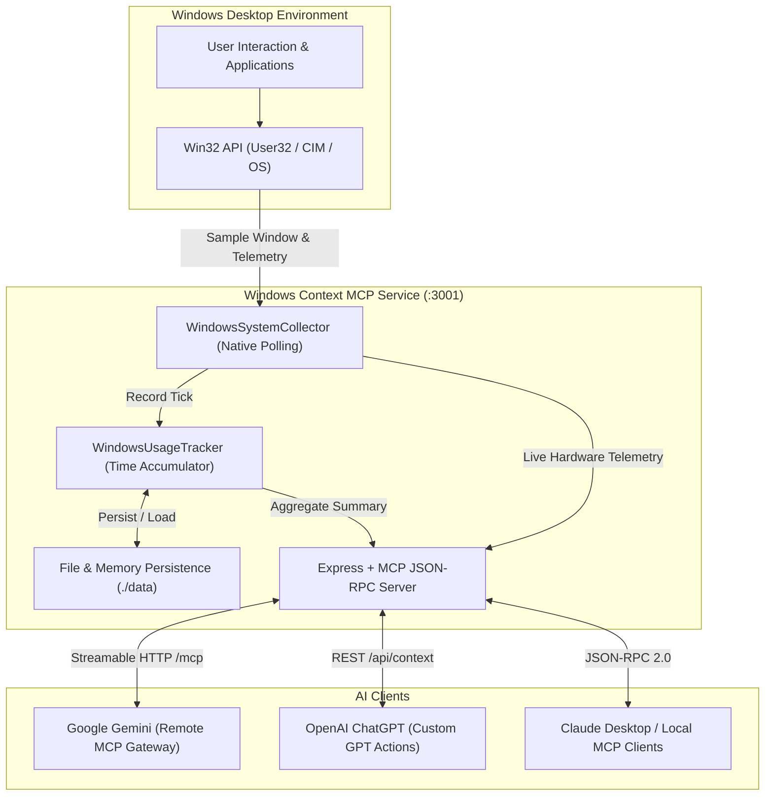

# Windows Context MCP Architecture 🪟⚙️

## System Overview

## Core Modules

1. **`WindowsSystemCollector` (`src/collector.ts`)**:
   - Queries `GetForegroundWindow`, `GetWindowText`, and `GetWindowThreadProcessId` via native PowerShell Win32 bindings.
   - Extracts CPU %, RAM total/free/used %, and battery charging states.

2. **`WindowsUsageTracker` (`src/tracker.ts`)**:
   - Accumulates active seconds per executable.
   - Categorizes apps into Productive, Communication, Entertainment, and Browsing.
   - Persists daily snapshots in `data/usage_YYYY-MM-DD.json`.

3. **`Server & MCP Handlers` (`src/server.ts` & `src/tools.ts`)**:
   - Provides standard JSON-RPC 2.0 protocol on `/mcp`.
   - Exposes 6 specialized MCP tools for AI productivity workflows.
